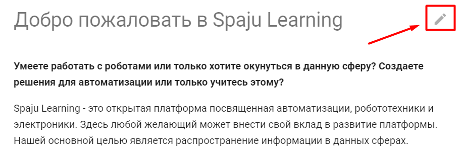
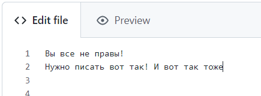
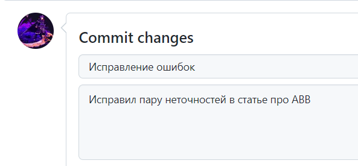
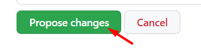

# Редактирования платформы

Сама платформа расположена на [Github](https://github.com/TheNameXDD/Spaju-learning/) поэтому для редактирования учебника вам необходим аккаунт на Github и навыки владением [markdown](https://www.markdownguide.org/basic-syntax/).

### Начать редактирование

Чтобы начать редактировать перейдите на ту публикацию в которой вы хотите что-то изменить. Далее найдите в правом верхнем углу публикации изображение карандаша (т.е. редактировать)

[{: .border }](img/1_step.png)

После этого создайте форк репозитория и начните редактировать текст в редакторе github. Нажав на preview вы сможете увидеть ваши изменения и как его увидят остальные пользователи.

[{: .border }](img/editor.png)

В commit changes необходимо максимально кратко и понятно пояснить что вы сделали. При необходимости можете прикрепить ссылку на обсуждение/скриншот

[{: .border }](img/2_step.png)

С помощью propose change вы отправите ваши изменения в ветку репозитория. Вам останеться только подождать решение модератора платформы. Когда ваше изменение будет принято и появится на платформе вы сможете увидеть в конце публикации ваш аккаунт на github подписанный как "внес вклад"

[{: .border }](img/3_step.png)
